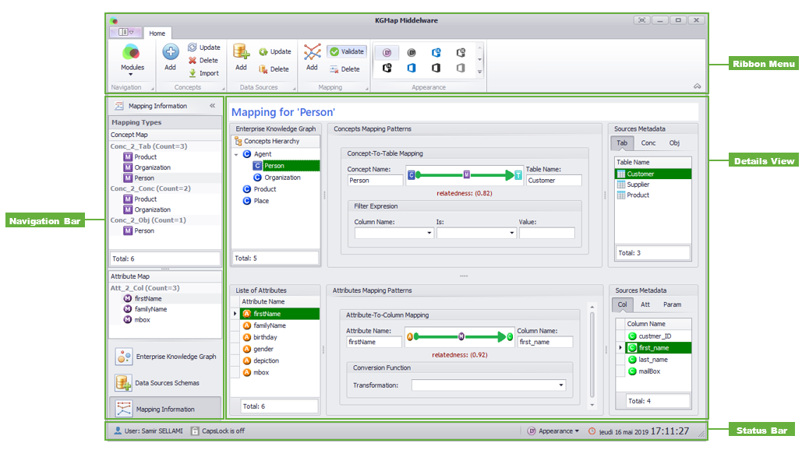

# KGMap UI
The implementation of the KGMap is a service-oriented middleware that relates entities about persons, organizations, and products from private enterprise CRM relational database with semi-structured Facebook social data and DBpedia dataset.

The **“Navigation Bar”** shows concept mapping _(Concept Map)_ and Attribute Mapping _(Attribute Map)_ types of mapping, each grouped in sub-categories (_Conc_2_Tab, Conc_2_Conc, Conc_2_Obj_ for Concept Mapping and _Att_2_Col, Att_2_Att, Att_2_Param_ for Attribute Mapping). When the expert chooses a _Concept Map_, the **“Navigation Bar”** shows its related _Attributes Map_. The **“Details View”** presents the knowledge graph and data sources elements in hierarchical tree nodes and illustrate the mapping patterns between them. Using the **“Ribbon Menu,”** the expert can validate, add, delete or edit the mapping information patterns. In the bottom **"Status Bar"** displays the current state of the application, connected user, date and time as well as helpful keyboard shortcuts.
